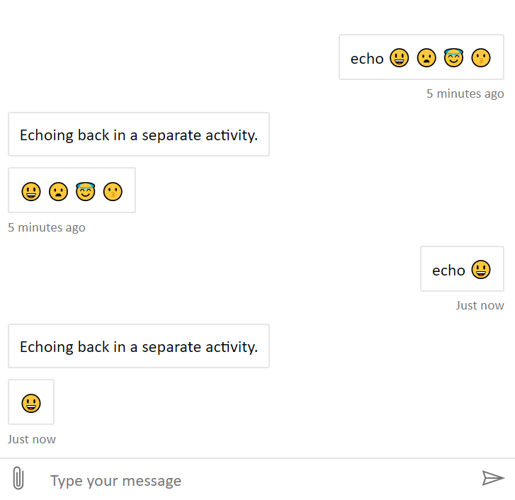

# Web Chat - Emoji

## Overview

This sample utilizes the Cognitive Services Speech Services SDK to allow the user to specify the microphone input among a list on the computer.

## How to run this sample

1. Clone this repo
1. Navigate to the repo directory in terminal
1. run `npx serve`
1. Navigate to [https://localhost:5000/index.html](https://localhost:5000/index.html)
1. Press the send button. See your emoji get rendered as markdown.

## Preview

You should see the following:

## Notes

1. This is using a manual build of Web Chat, which may or may not be up-to-date. See webchatjs.txt in the root directory for current build date.
1. Please note that `markdown-it-emoji` adds plenty of emoji, but is not comprehensive. For example, different skin tones are not available, and so cannot be rendered in Web Chat using this method.
1. For now, this sample renders emoji in the transcript, both from the user and the bot.
1. **Emoji working in the SendBox is TBD! Stay tuned. :)**

## Further reading

- [emoji request](https://github.com/microsoft/BotFramework-WebChat/issues/1072) - Markdown-it with emoji
