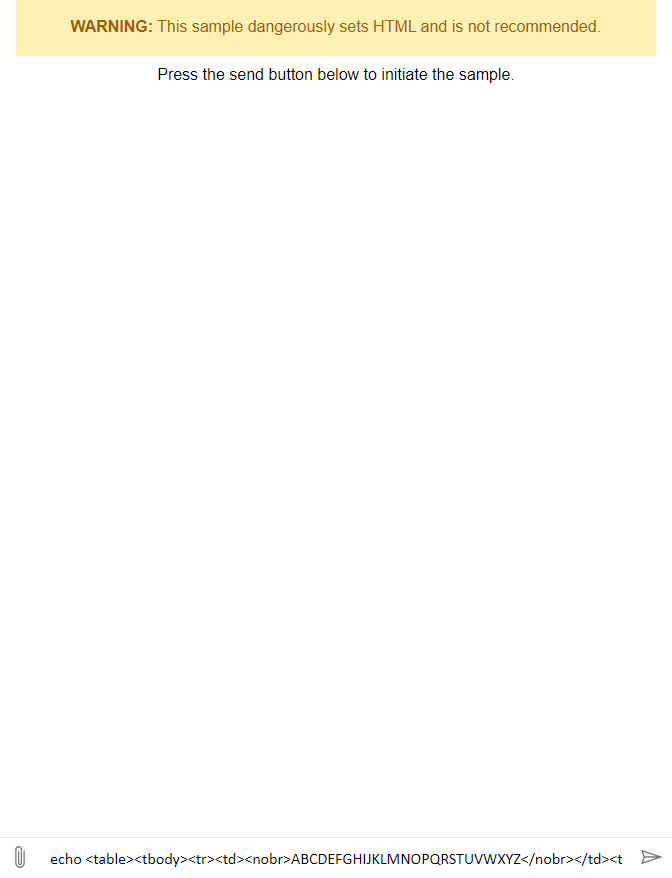

# Sidescrolling Web Chat

This is a brief sample creating a custom attachment renderer to add sidescrolling to the activity when the content has overfill.

## How to run this sample

1. Clone this repo
1. Navigate to the repo directory in terminal
1. run `npx serve`
1. Navigate to https://localhost:5000/index.html

## Preview

You should see the following:

## Notes

1. This is using a manual build of Web Chat, which may or may not be up-to-date. See webchatjs.txt in the root directory for current build date.

## Further reading

To learn more from Web Chat's existing samples, please see the related samples linked below.

1. [1.a - Getting started](https://github.com/microsoft/BotFramework-WebChat/tree/master/samples/01.a.getting-started-full-bundle)
1. [3.a - Host with React](https://github.com/microsoft/BotFramework-WebChat/tree/master/samples/03.a.host-with-react)
1. [10.a - Attachment middleware](https://github.com/microsoft/BotFramework-WebChat/tree/master/samples/10.a.customization-card-components)
